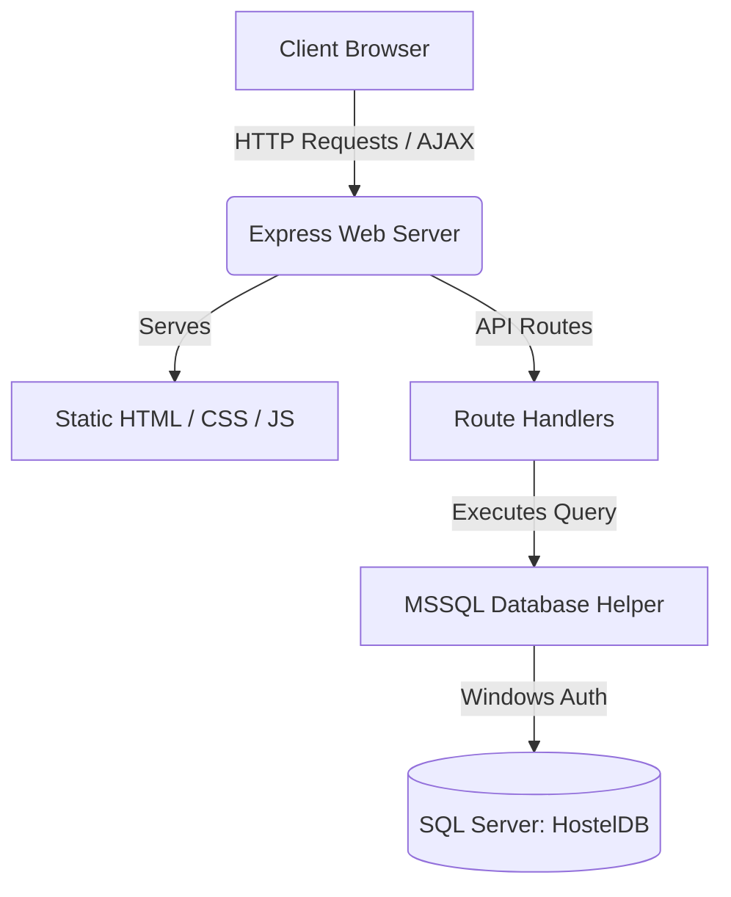
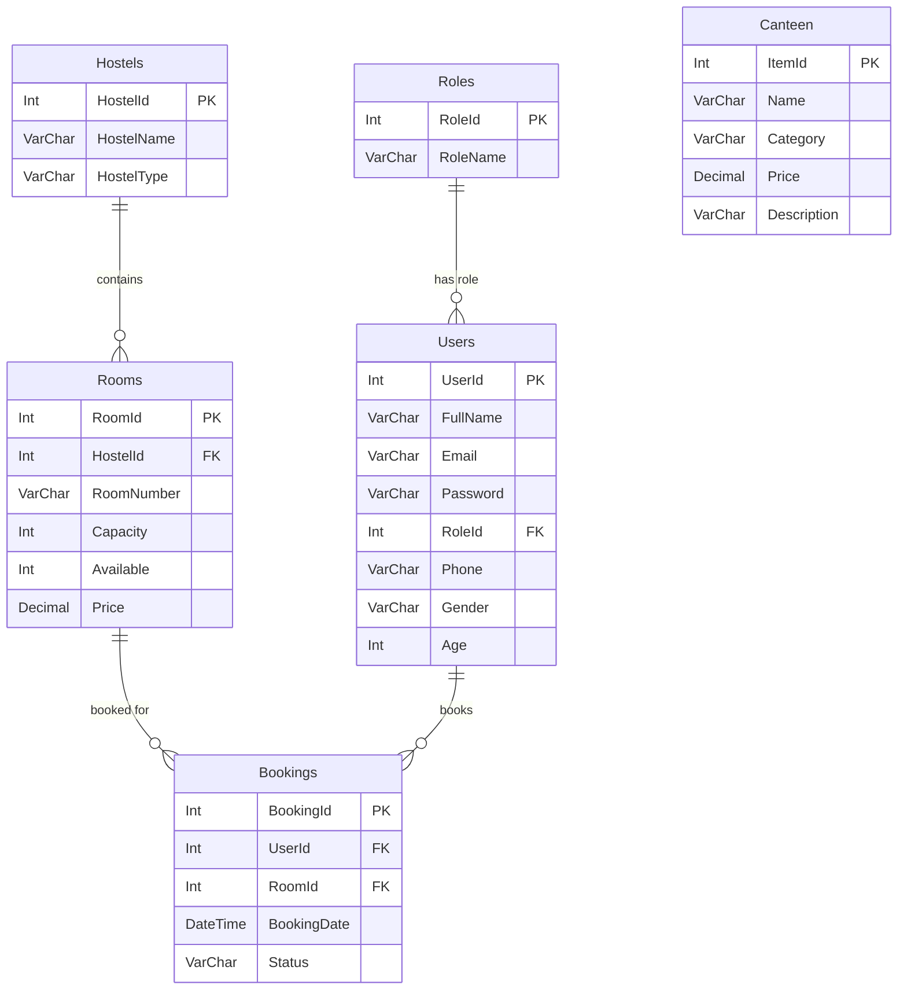

# Technical & Functional Project Explanation

Welcome to the **GC University Lahore Hostel Management System (HostelDayz)**. This document provides a comprehensive technical overview of the project's architecture, database schema, portability mechanics, and frontend-backend interaction flows.

---

## 👨‍💻 Project Creators
This project was developed by:
*   **Fatima Rana**
*   **Juniad Hassan**
*   **Hadi Hassan**

---

## 🛠️ Technology Stack

1.  **Frontend (UI/UX)**:
    *   **Structure**: HTML5 Semantic markup.
    *   **Styling**: Modern, premium CSS3 built on the **Bootstrap** framework with dynamic scroll animations (**AOS - Animate On Scroll**).
    *   **Interactions**: **jQuery** and AJAX for smooth, single-page-like interactive dashboard updates without full page reloads.
2.  **Backend (Application Server)**:
    *   **Runtime**: **Node.js**
    *   **Framework**: **Express.js**
    *   **Middleware**:
        *   `body-parser`: Formats incoming JSON payloads and URL-encoded forms.
        *   `cookie-parser`: Manages secure client sessions via browser cookies.
3.  **Database Layer**:
    *   **Engine**: **Microsoft SQL Server (SQLEXPRESS)**
    *   **Connection Driver**: `mssql` with `msnodesqlv8` for native, secure Windows Integrated Authentication (no password hardcoding required).

---

## ⚙️ System Architecture & Dynamic Flow

The application transitions from a legacy static website to a modern, dynamic Model-View-Controller style architecture:



### 1. Zero-Configuration Database Portability
Moving SQL Server databases between machines normally requires exporting `.bak` files or manually running migration scripts. This project implements a **zero-configuration startup routine** inside the Express server (`server.js`):
1.  **Connecting to Master Database**: Since `master` is a default system database on all SQL Server instances, the server connects here first.
2.  **Database Verification**: It checks if a database named `HostelDB` exists. If not, it programmatically runs `CREATE DATABASE HostelDB`.
3.  **Schema Verification**: It closes the connection to `master`, reconnects to `HostelDB`, and checks for the existence of core tables (e.g. `Roles`).
4.  **Automated Compilation & Seeding**: If the tables are absent, it compiles the full schema (6 tables) and seeds all demo logins, GCU hostels, Lahori canteen items, and sample bookings instantly before starting the web server.

### 2. Secure Session Management
*   Authentications are managed via a cookie named `user` containing a JSON payload with user identity (`UserId`, `FullName`, `RoleId`, `RoleName`).
*   This cookie is checked by the dynamic dashboards and api routes to ensure role-specific permissions (e.g., student pages cannot view warden management actions).

---

## 🗄️ Database Schema & Relationships

The relational database is comprised of 6 interconnected tables:



### Table Breakdown
1.  **Roles**: Categorizes users into `Admin` (1), `Warden` (2), or `Student` (3).
2.  **Users**: Stores user profiles, contact numbers, and login credentials.
3.  **Hostels**: Defines wings: `Iqbal Hostel` (Boys), `Jinnah Hostel` (Boys), and `Fatima Jinnah Hostel` (Girls).
4.  **Rooms**: Connects to hostels and holds capacity, live availability counts, and semester pricing.
5.  **Bookings**: Links students to specific hostel rooms. Maintains real-time status (`Pending`, `Approved`, `Cancelled`).
6.  **Canteen**: Contains standard food inventory customized to traditional Lahori dishes (Siri Paye, Nihari, Halwa Puri, Butt Karahi, Rabri Falooda, etc.).

---

## 💻 Technical Walkthrough of API Routes

### 🔐 Authentication API (`POST /api/login`)
*   Takes JSON containing `email` and `password`.
*   Executes a parameterized query against `Users` to prevent SQL injection:
    ```sql
    SELECT u.UserId, u.FullName, u.Email, u.RoleId, r.RoleName
    FROM Users u JOIN Roles r ON u.RoleId = r.RoleId
    WHERE u.Email = @email AND u.Password = @password
    ```
*   If found, registers a `user` session cookie.

### 📊 Role-Based Dashboard API (`GET /api/dashboard`)
*   Extracts user session cookie.
*   **Student (RoleId = 3)**: Queries their room booking details, current room status, and roommates sharing their approved room.
*   **Warden (RoleId = 2)**: Returns all active student bookings for quick approvals or cancellations.
*   **Admin (RoleId = 1)**: Returns high-level metrics (Total Hostels, Rooms, Active Students, Approved Bookings, Pending Bookings, and Total Semester Revenue) along with transaction logs.

### 🍔 Lahori Canteen API (`GET /api/canteen`)
*   Retrieves all canteen menu items dynamically grouped into Breakfast, Lunch, Desserts, and Drinks.
*   Returns JSON to the client to dynamically build the ordering list on the student dashboard.

### 📝 Booking Actions API (`POST /api/bookings/action`)
*   Used by Admins and Wardens to approve or cancel student requests.
*   **Capacity Control**: Programmatically decreases room availability (`Available = Available - 1`) upon booking approval, and increases it back if a booking is cancelled, avoiding over-booking rooms.
